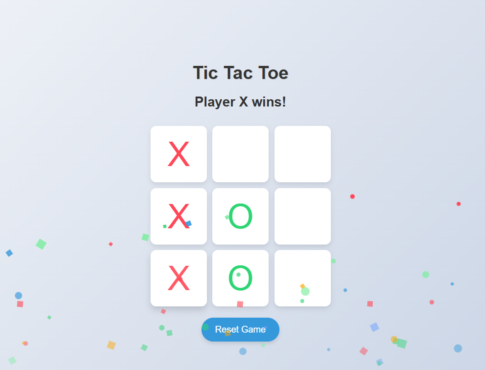

# 🎮 Tic Tac Toe Game

A beautifully styled and animated **Tic Tac Toe** game built using **HTML**, **CSS**, and **JavaScript**. This game allows two players to play against each other in a classic 3x3 grid with smooth animations, confetti celebration, and responsive UI.

🌐 [Live Demo](https://tikesh-sahu-git.github.io/Tic-Tac-Toe/)

---

## ✨ Features

- 🎨 Modern UI with subtle hover and click animations
- 💥 Confetti effect on winning
- 🔁 Game reset functionality
- 📱 Responsive design for various screen sizes
- ⚡ Smooth animations and transitions
- ♿ Basic accessibility features

---

## 🛠️ Built With

- **HTML5** – Structure
- **CSS3** – Styling and animations
- **JavaScript (Vanilla)** – Game logic and DOM manipulation

---

## 📸 Screenshots



---

## 🚀 How to Play

1. Open the game in your browser.
2. Player **X** starts first.
3. Click on an empty cell to mark it.
4. Alternate turns between **X** and **O**.
5. First to align 3 marks (horizontally, vertically, or diagonally) wins!
6. Click **Reset Game** to start over.

---

## 📂 Project Structure

```

Tic-Tac-Toe/
│
├── index.html        # Main HTML file
├── styles.css        # Styling and animations
├── script.js         # Game logic
└── README.md         # Project documentation

````

---

## 📦 How to Run Locally

1. Clone the repository:
   ```bash
   git clone https://github.com/tikesh-sahu/Tic-Tac-Toe.git
````

2. Navigate to the folder:

   ```bash
   cd Tic-Tac-Toe
   ```

3. Open `index.html` in your browser.

---

## 🖼️ Deployment

This project is deployed using **GitHub Pages**:
🔗 [https://tikesh-sahu-git.github.io/Tic-Tac-Toe/](https://tikesh-sahu-git.github.io/Tic-Tac-Toe/)

To redeploy:

```bash
git add .
git commit -m "Update"
git push
```

---

## 💡 Future Improvements

* [ ] Add AI mode to play vs computer
* [ ] Scoreboard tracking
* [ ] Dark mode toggle
* [ ] Sound effects on move and win

---

## 📜 License

This project is open-source and available under the [MIT License](LICENSE).

---

## 🙌 Acknowledgements

* UI inspiration from various CSS animation examples
* Special thanks to the [JavaScript](https://developer.mozilla.org/en-US/docs/Web/JavaScript) and [CSS Tricks](https://css-tricks.com/) communities

---

## 👋 Author

**Tikesh Sahu**
